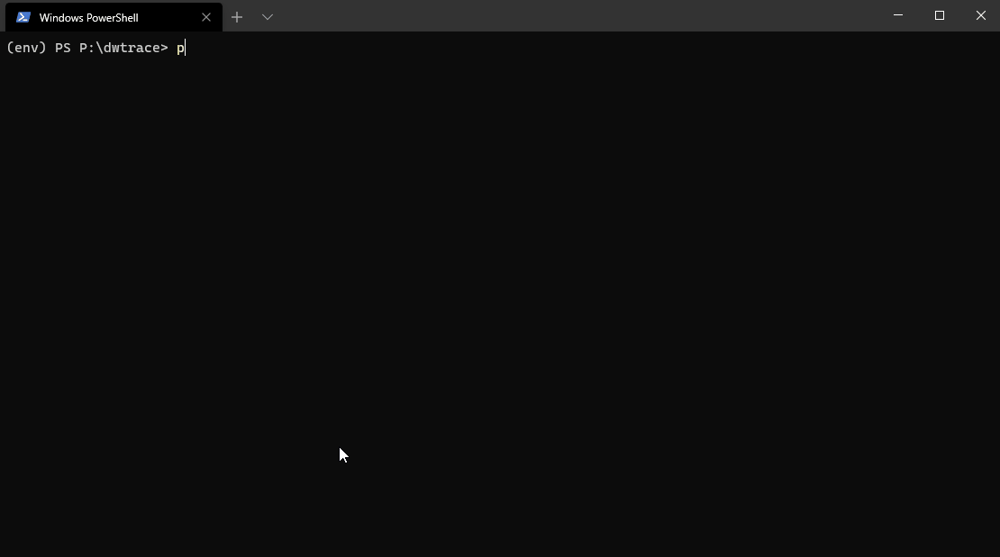
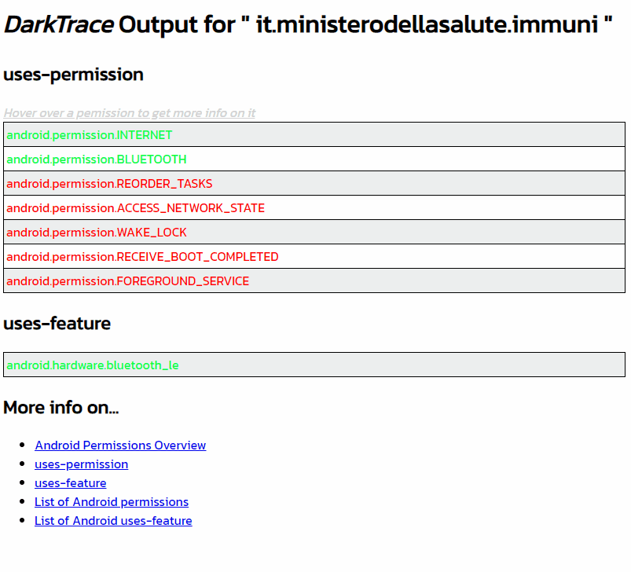

# DWTrace
DWTrace is a tool designed to evaluate the privacy of Android applications and is aimed at gaining a better understanding of Android permissions in general. We have a  writeup on our research blog about why we developed the tool; it also included an example scenario of analysing the COVID-19 contact tracing apps: [link](https://research.darkwaves.io/privacy-tracing-and-tracking-on-android/).



If you then navigate to the "reports" folder, you'll notice an html file named like the app's package name, and if you open it:



We hope this tool can be a valid aid to assess quickly and easily if an app respects the users's privacy. 

## Latest Update
### Whitelist, Blacklist or simple output mode
DWTrace has been updated to support external loading of whitelisted or blacklisted items from a .txt file. To use this feature, simply run DWTrace with the option ```-w whitelist.txt``` for whitelist mode, ```-b blacklist.txt``` for blacklist mode or ```-n``` for simple output. Note that the whitelist or blacklist file can have any name, though it is important that each item in the list be separated by a new line. 
Tip: refer to the official documentation to get a list of permissions ([link](https://developer.android.com/guide/topics/manifest/uses-permission-element))

## Features

### Batch or single file mode
DWTrace can be run on a single apk file, or a folder of apps. These are, respectively, the ```--i``` and ```--f``` options

### Cheatsheet
There are a lot of possible permissions an app can request. To make it easier to know exactly what a permission is doing, in the report, when you hover over a permission, it will bring up a detailed description of what this permission does. In a future update of the software this will also be available for the uses-feature section of the report. In a future update, the whitelist will also be available as a standalone html file to quickly and easily get more info on any android permission. For the moment, you can refer to the official android documentation on [uses-permission](https://developer.android.com/guide/topics/manifest/uses-permission-element) and [uses-feature](https://developer.android.com/guide/topics/manifest/uses-feature-element)

# Installation
* Clone the repository and cd into it
* create a new virtual envirornment with ```virtualenv env``` and then activate it ```env/Scripts/bin/activate```
* install the required python libraries with ```pip install -r requirements.txt```
* install axmldec: [link](https://github.com/ytsutano/axmldec); on Linux and Windows, move the executable in the same folder as dwtrace.py
